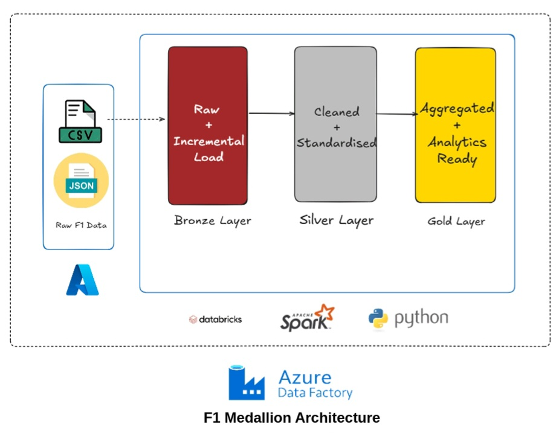
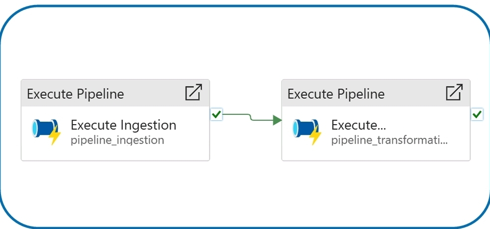
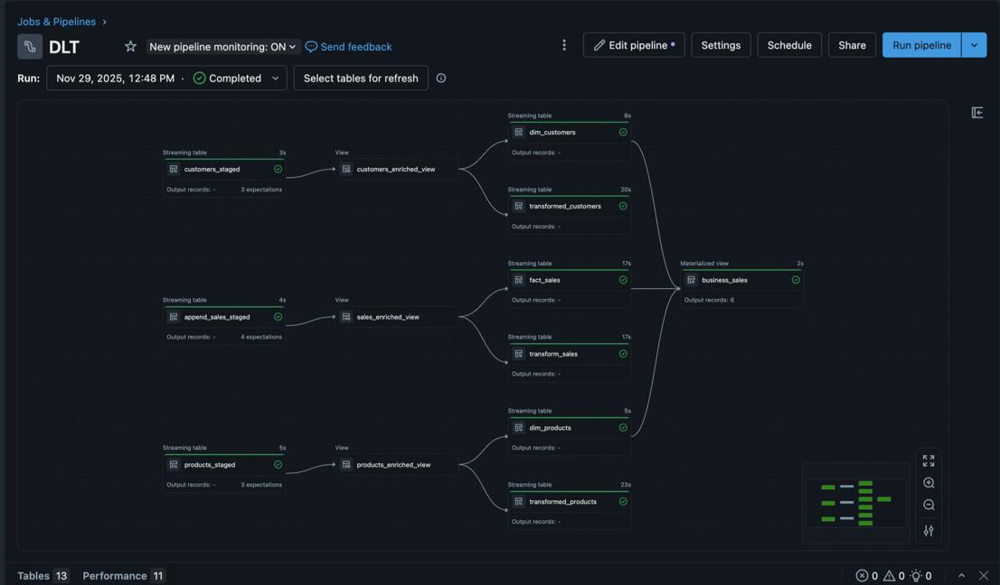

# 🏎️ Azure Databricks Formula 1 Data Engineering Project

### *Azure Data Factory • Azure Databricks • PySpark • Delta Lake • Delta Live Tables*

This repository contains two complete, production-grade data engineering pipelines built using modern lakehouse architecture:

1. **Formula 1 Medallion Architecture Pipeline (Bronze → Silver → Gold)**
2. **Consumer Dataset Pipeline using Delta Live Tables (DLT)**

Both pipelines follow industry-standard engineering patterns and are fully modular.

---

# 📁 Repository Structure

```
F1_data_engineering/
│
├── Formula1/
│   ├── demo/
│   ├── includes/
│   ├── ingestion/          → Bronze Layer
│   ├── trans/              → Silver & Analytics Layer
│   ├── gold/               → Gold Layer (Curated)
│   └── utils/
│
├── dlt-yt/
│   └── DLT_Root/
│       ├── explorations/
│       ├── transformations/
│       │   ├── bronze/
│       │   ├── silver/
│       │   └── gold/
│       └── utilities/
│
└── diagrams/               → Architecture diagrams
    ├── architecture_f1.jpg
    ├── adf_pipeline_sequence.jpg
    └── dlt_pipeline_dag.jpeg
```

---

# 🧱 1. Formula 1 Lakehouse Pipeline (Databricks)

A full end-to-end pipeline implemented using the **Medallion Architecture**:

```
Raw Data → Bronze (Raw + Incremental) → Silver (Cleaned) → Gold (Aggregated, BI-ready)
```

### 📌 Architecture Diagram




---

# 🟤 Bronze Layer (Raw + Incremental Ingestion)

📂 `Formula1/ingestion/`

Scripts include:

```
1.ingest_circuits_file.py
2.ingest_race_file.py
3.ingest_constructors_file.py
4.ingest_drivers_file.py
5.ingest_results_file.py
6.ingest_pitstops_file.py
7.ingest_lap_times_folder.py
8.ingest_qualifying_folders.py
```

### **Features**

* Loads CSV + multiline JSON into ADLS
* Converts raw files to Delta Bronze
* Adds ingestion metadata
* Supports folder ingestion
* **Incremental ingestion implemented with Delta MERGE (UPSERT) via PySpark**

---

# ⚪ Silver Layer (Cleaned & Standardized)

📂 `Formula1/trans/`

### **Key silver outputs:**

* `race_results.py`
* `driver_standings.py`
* `constructor_standings.py`
* `calculated_race_results.py`

### Silver Layer Output Table:

```
f1_presentation.race_results
```

---

# 🟡 Gold Layer (Curated Analytics)

📂 `Formula1/gold/`

This layer contains **aggregated**, **business-ready**, **BI-optimized** tables.

### **Dimension Tables**

* `dim_driver`
* `dim_constructor`
* `dim_circuit`

### **Fact Tables**

* `fact_race_results`
* `fact_driver_performance`
* `fact_constructor_performance`
* `fact_season_summary`

### Purpose

✔ Power BI dashboards
✔ Year-over-year performance analysis
✔ Season standings aggregation
✔ Clean fact/dim modeling

---

# ⚡ Azure Data Factory Orchestration

ADF orchestrates the full ingestion → silver → gold workflow.

### 📌 ADF Pipeline Diagram




---

# 🔵 2. Delta Live Tables Pipeline (DLT)

📂 `dlt-yt/DLT_Root/`

A declarative ETL pipeline using Delta Live Tables.

### **Key Features**

* Auto-managed Bronze/Silver/Gold tables
* Streaming ingestion
* Data quality expectations
* Automated lineage DAG
* Schema inference + evolution

### 📌 DLT Pipeline Diagram




---

# 📊 DLT Outputs

### **Bronze**

* `customers_staged`
* `products_staged`
* `append_sales_staged`

### **Silver**

* Enriched customers
* Enriched products
* Enriched sales

### **Gold**

* `fact_sales`
* `business_sales` (Materialized View)

---

# 🚀 How to Run

## **Formula 1 Pipeline**

1. Import the `Formula1/` folder into Databricks
2. Set ADLS configs in `includes/common_functions.py`
3. Run Bronze scripts → load raw into Delta
4. Run Silver scripts
5. Run Gold scripts
6. Validate tables in `f1_presentation` schema

---

## **DLT Pipeline**

1. Go to Databricks → Workflows → Delta Live Tables
2. Create Pipeline → point to:

```
dlt-yt/DLT_Root/transformations/
```

3. Set target schema + checkpoint
4. Run pipeline
5. Explore DAG + data quality reports

---

# 🧪 Technologies Used

### Cloud

* Azure Data Factory
* Azure Databricks
* ADLS Gen2

### Data Engineering

* PySpark
* Delta Lake
* Delta Live Tables
* MERGE INTO (Incremental)
* Medallion Architecture

### Analytics

* Fact/Dimension Modeling
* Aggregations & Window Functions
* KPI calculation
* BI-Ready Gold Tables

---

# 👨‍💻 Author

**Rehneet Singh**
